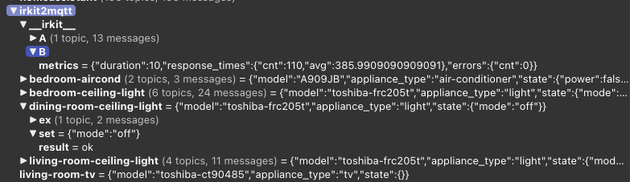

irkit2mqtt
==========



Allows IRKits and IRKit-controlled appliances (Air-cond, TV, lights, ..) to appear stateful and 
operable using MQTT.

PREREQUESITES
=============

- [IRKit](https://jp.mercari.com/search?keyword=irkit&status=on_sale)s
- linux or macos
- nodejs > 16
- nmap

INSTALLING
===========

1. run `npm i`

1. create `conf/irkit2mqtt.json5` (use [conf-sample](conf-sample) as a reference)

1. copy or symlink cert files to `conf/certs/*`, adding all references to above conf json file

1. enter path of log file to `conf/log-location.txt` (to omit logging, or log to syslog, skip this step)

1. run `install-service.sh` to enable systemd service and start running


RUNNING
=======

once the systemd service installed (via `install-service.sh`) you can start the service by issuing :

`sudo systemctl restart irkit2mqtt`

or, to stop the service :

`sudo systemctl stop irkit2mqtt`

Logs are logged into the path specified in `conf/log-location.txt`. 

To run without sytemd, issue command

`./start.sh`

and press ^C (or run `./stop.sh`) to exit.


ON APPLIANCES
=============

An appliance is a device that receives IR signal from an IRKit.  Multiple IRKits may be defined but must stay in the same network.
For example, you may have IRKit 'A' in your living room and IRKit 'B' in your basement, each responsible for controlling different
appliances.

When an IRKit no longer responds to GET-messages requests, or when a POST fails, the IRKit is deemed "unhealthy." All associated
appliances will be marked as "not available."


CONFIGURING
===========

Save your configuration files to `conf/irkit2mqtt.json5`.

To properly discover an IRKit, define .irkits and .discovery:

```
{
    irkits: {
        "living-room-irkit": { mac : "xx:xx:xx:xx:xx:xx" },
        // ^ name of IRKit
    },
    discovery: {
        "interval": 600,        // rediscovery interval in seconds
        "interface": "wlan0",  
        "scan_target": "192.168.xx.0-255",  // the IP range of all irkits
        "nmap": "/usr/bin/nmap",     // location of nmap
    }
}
```

To add appliances, define `.appliances`. Remember to link each applaince to the right IRKit using 
the `.appliances.*.model` field. 

```
{
   "appliances":{
        "living-room-aircond": {
        // ▲ Name of appliance
        //                       ▼ name of IRKit‥  
            "irkit": "living-room-irkit",
            "model": "A909JB"
        },
        "living-room-ceiling-light": {
            "irkit": "living-room-irkit",
            "model": "toshiba-frc205t",
            "setup": { "ch": "1" }
        },
}
```

MQTT MESSAGES
==============

Default mesage prefix is :`irkit2mqtt`

## published topic `irkit2mqtt/__irkit__/{IRKIT_NAME}/message`

message body : JSON 
  
| field | format | meaning | example |
| ----- | ------ | ------- | ------- | 
| `.message` | `object` | raw message received by IRKit | `{"format":"raw", "freq":38, "data": [ 1000, 1000, ... ]}` |
| `.message.raw` | `string` | IRKit constant `"raw"` | |
| `.message.freq` | `number` | IRKit constant `38` | |
| `.message.data` | `number[]` | Infrared pulses in μsec | |
| `.guessed` | `object` | guessed IRKit transmission, may be absent. | `{"format":"nec","T":625,"frames":[[1,1,1,0,0,..],"repeat"]}` |
| `.guessed.format` | `string` | guessed format, should be `aeha`, `nec` or `sony` | |
| `.guessed.T` | `number` | guessed T value of the transmission; see : [赤外線リモコンの通信フォーマット](http://elm-chan.org/docs/ir_format.html) | `625` |
| `.guessed.frames` | `Array[]` | transmission fames | | 
| `.guessed.frames.[]` | `{number|sring}[]` or `string` | guessed bits, for unknown bits a `'?'` would be in place; a repeat is denoted by `"repeat"` | |
 
example 

```
{
  "message": {
    "format": "raw",
    "freq": 38,
    "data": [
      19991, 10047, 1275, 3704, 1275, 3704, 1275, 3704, 1275, 1275, 1275, 1275, 1275, 3704, 1275, 3704, 1275, 3704, 1275, 1275, 1275, 1275, 1275, 3704, 1275,
      3704, 1275, 1275, 1275, 1275, 1275, 1275, 1275, 1275, 1275, 1275, 1275, 1275, 1275, 3704, 1275, 1275, 1275, 1275, 1275, 1275, 1275, 1275, 1275, 3704,
      1275, 3704, 1275, 3704, 1275, 1275, 1275, 3704, 1275, 3704, 1275, 3704, 1275, 3704, 1275, 1275, 1275 ]
  },
  "guessed": {
    "format": "nec",
    "T": 625,
    "frames": [ [ 1, 1, 1, 0, 0, 1, 1, 1, 0, 0, 1, 1, 0, 0, 0, 0, 0, 0, 1, 0, 0, 0, 0, 1, 1, 1, 0, 1, 1, 1, 1, 0 ] ]
  }
}

```

## published topic `irkit2mqtt/{APPLIANCE_NAME}`

Published whenever the appliance state has been updated via Irkit2mqtt

message body : JSON

| field | format | meaning | example |
| ----- | ------ | ------- | ------- | 
| `.model` | `string` | appliance model name, corresponds to your configuration setting | `"toshiba-frc205t"` |
| `.appliance_type` | `string` | appliance type provided by plugin | `"light"` |
| `.state` | `object` | current state of the appliance; this object may not have all values if it's never been set (we don't know who else has operated on the appliance); it might be an empty object `{}` at startup. | `{"mode":"off"}` |

example

```
{"model":"toshiba-frc205t","appliance_type":"light","state":{"mode":"off","brightness":0}}
```

## published topic `irkit2mqtt/{APPLIANCE_NAME}/availability`

Pushed when the health status of the underlying IrKit changes.

mesasge body : text `yes` or `no`


## subscribed topic `irkit2mqtt/{APPLIANCE_NAME}/set`

send a message on this topic to update an appliance's state. The message body should be valid JSON5 or JSON.

example

```
{mode:"normal", brightness:10}
```

## subscribed topic `irkit2mqtt/{APPLIANCE_NAME}/do/{ACTION_NAME}`

Send a message on this topic to perform a quick action on an appliance. Depending on the appliance this may cause a state udpate.

Message body should be empty.


## published topic `irkit2mqtt/{APPLIANCE_NAME}/ex/{EX_FIELD_NAME}`

Published when an "ex" field is updated.

<details><summary> about "ex" fields</summary>

An "ex" field is a field that's separated from the intrinsic appliance states. 

Some platforms such as Home Assistant mqtt, require very specific mqtt topic formats, for example [MQTT HVAC](https://www.home-assistant.io/integrations/climate.mqtt/) 
requires that the air-conditioner's operating mode to be published using a separate topic, however irkit2mqtt appliances only publish an overall JSON state.
To overcome this, a separate class of plugins called "mqtt-rewrite" plugins are written to translate internal appliance states to individual topics, performing 
value/unit conversions where necessary.

For details see 'plugins.'

</details>

Message body depends on the field. Usually it is plain value e.g. `unquoted string` or `plain number`.

## subscribed topic `irkit2mqtt/{APPLIANCE_NAME}/ex/{EX_FIELD_NAME}/set`

Send a message to this topic to update its internal states. This is reserved for platforms like Home Assistant mqtt.


## published topic `irkit2mqtt/__irkit__/{IRKIT_NAME}/metrics`

Published every 10 minute for recent IRKit comm metrics. Example:

```
{
  "duration": 10,
  "response_times": {
    "cnt": 98,
    "avg": 464.83673469387753
  },
  "errors": {
    "cnt": 0
  }
}
```

| field | type | meaning |
| ----- | ---- | ------- |
| `.duration` | number | duration in minutes in which the following metrics are derived |
| `.response_times.cnt` | number | number of requests made |
| `.response_times.avg` | number | average response time in milliseconds |
| `.errors.cnt` | number | number of failed requests |


Plugins 
========

TBD
